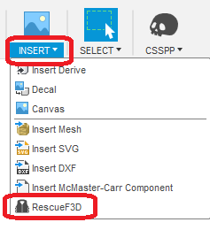
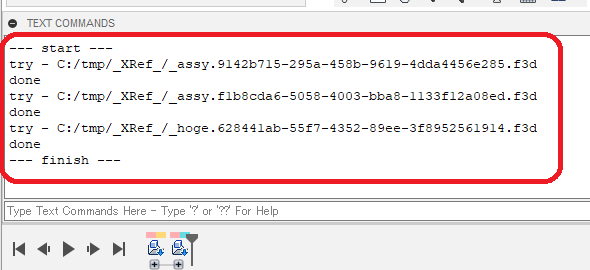
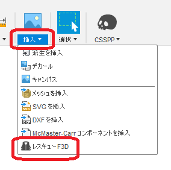
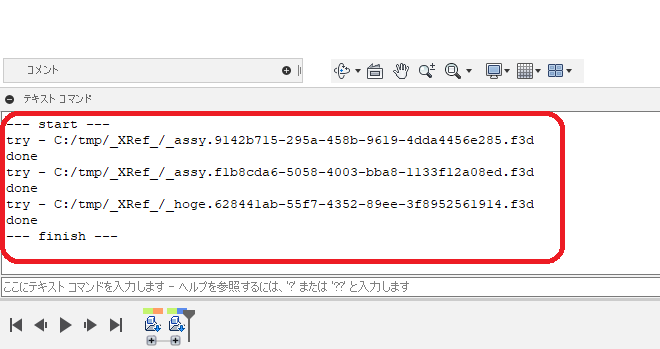

# ***Fusion360 Rescue F3D***
This is a Add-in for Autodesk software "Fusion360".

Import only shape data(solid surface) from the Fusion360 archive file ".f3d".  
If you want to open a good f3d file, We strongly recommend that you use the "Open" command or the "Upload" in the data panel.  

The f3d file that cannot be "opened" or "uploaded" has a linked component and is located in the local cache folder.
The purpose of this add-in is to rescue only the shapes in these unopenable f3d files.

Only the shape data is imported, so
+ History
+ Material / appearance
+ Joints

Etc. cannot be imported.

It is best not to be in a situation to use this add-in.
***

### Installation:
Please follow the instructions [here](https://knowledge.autodesk.com/support/fusion-360/troubleshooting/caas/sfdcarticles/sfdcarticles/How-to-install-an-ADD-IN-and-Script-in-Fusion-360.html).

### Usage

1. Start Add-in. "RescueF3D" is added in the "Insert" tab.  

1. Click "RescueF3D".

1. Select the f3d file you want to import from the Open File dialog. (Multiple selections are possible)

1. A new document will be created and import the shape data of the specified f3d file as a component.

+ Newly created documents will be forcibly saved.  
+ Create a new document for "Rescue_F3D_xx" in the "Rescue_F3D" project in the data panel.  
+ A file is saved each time one shape data is imported. Even if Fusion360 crashes, the data that was successfully imported is still saved.
+ If you use the command with the "TextCommands" panel displayed, a small log is displayed.  

### Action:
Confirmed in the following environment.
+ Fusion360 Ver2.0.10032
+ Windows10 64bit Pro , Home

### License:
MIT

### Acknowledgments:
+ Thank you everyone in the [Japanese forum.](https://forums.autodesk.com/t5/fusion-360-ri-ben-yu/bd-p/707)

***
***
以下、日本語です。

これは、オートデスクソフトウェア「Fusion360」のアドインです。

Fusion360のアーカイブファイル ".f3d" から、形状データ(ソリッド・サーフェス)のみをインポートします。
問題の無いf3dファイルは、"開く"コマンド 又は データパネルの "Upload" を使用することを強くお勧めします。

"開く" 又は "Upload" が出来ないf3dファイルは、リンク付きコンポーネントを持っているもので、ローカルキャッシュフォルダ内に存在しています。  
これらの開く事の出来ないf3dファイル内の形状だけを救い出す事が、本アドインの目的です。  
インポートするのは、あくまで形状データのみの為、  
+ 履歴
+ マテリアル・外観
+ ジョイント類  

等はインポート出来ません。  
このアドインは利用する状況にならない事が、最も望ましいです。
***
### インストール:
[こちら](https://knowledge.autodesk.com/ja/support/fusion-360/troubleshooting/caas/sfdcarticles/sfdcarticles/JPN/How-to-install-an-ADD-IN-and-Script-in-Fusion-360.html)の手順に従ってください。

### 使用法

1. アドインを起動。"挿入タブ" 内に "レスキューF3D" が追加されます。  

1. "レスキューF3D" をクリック。

1. ファイルを開くダイアログからインポートするf3dファイルを選択します。(複数選択可)

1. 新たなドキュメントが作成され、指定されたf3dファイルの形状データをコンポーネントとしてインポートします。  

+ 新たに作成されるドキュメントは強制的に保存されます。  
+ データパネル内の "Rescue_F3D" プロジェクト内に "Rescue_F3D_xx" のドキュメントを新たに作成します。  
+ 一つの形状データのインポート毎にファイルを保存しています。Fusion360がクラッシュした場合でも、インポートが成功したデータまでは保存されているハズです。
+ "テキストコマンド" パネルを表示させた状態でコマンドを利用すると、ちょっとしたログを表示させています。

GUIで処理を行い方、処理内容を知りたい方は[こちら](https://kantoku.hatenablog.com/entry/2020/10/12/101930?_ga=2.98287135.1474284259.1604048534-441502594.1604048534)をご覧ください。

### アクション:
以下の環境で確認しています。
 + Fusion360 Ver2.0.10032
 + Windows10 64bit Pro , Home

### ライセンス:
MIT

### 謝辞:
+ [日本語フォーラム](https://forums.autodesk.com/t5/fusion-360-ri-ben-yu/bd-p/707)の皆さん、ありがとう。
+ 上記の英語で不適切な部分をして頂けると助かります。